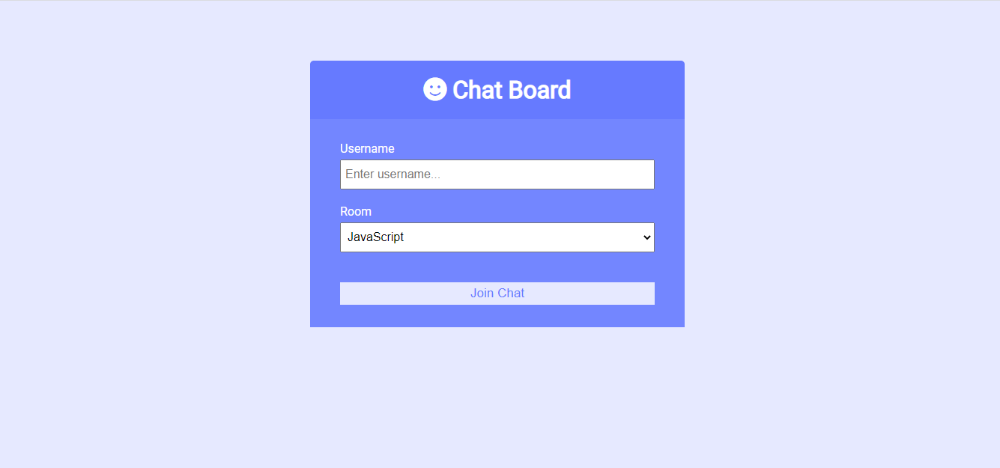
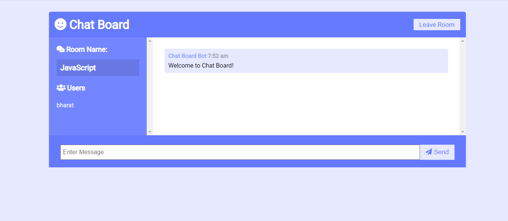
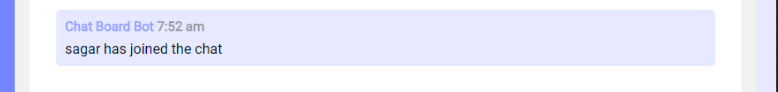

# Chat Board App
Realtime chat app with websockets using Node.js, Express and Socket.io


## Usage
```
git clone https://github.com/bharatpatil21/chat-board-socket.io.git
cd chat-board-socket.io
npm install
node server.js

Go to localhost:3000
```


## Sample images
Home page <br>


Chat-board page <br>


New user joined notification <br>


Typing user name in same room <br>

